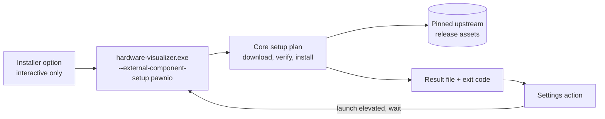

# External Component Setup Design

Status: proposed direction under
[ADR 0024](../adr/0024-external-component-setup.md).

This document records how HardwareVisualizer installs optional external
components on the user's request, which choices were evaluated, and which
decisions remain open. PawnIO on Windows is the first component. The shape is
component-neutral so a later component only adds a plan and copy, not a new
mechanism.

## Problem

PawnIO-backed CPU package temperature and power and Super I/O motherboard
sensors need three things that HardwareVisualizer's installer does not provide:
the PawnIO runtime (a signed kernel driver plus `PawnIOLib.dll`), the signed
module blobs from the separate PawnIO.Modules release, and administrator rights
to place both. External Component Guidance explains the manual steps, but the
steps are long enough that most users never complete them.

The maintainer's request is:

- offer the setup during installation as a per-component option that is
  selected by default and can be deselected;
- offer the same setup later from the Settings screen;
- never remove the component on uninstall, and only tell the user that it was
  kept, when the uninstaller can show anything.

## Upstream facts the design relies on

| Fact | Evidence |
| --- | --- |
| The runtime ships as `PawnIO_setup.exe` from the PawnIO.Setup GitHub release; the core install contains the runtime and tooling only, no sensor modules. | `docs/specs/sensors/pawnio-interface.md` (Installation and detection, Module blob distribution) |
| The installer elevates itself and supports an unattended mode with `-install -silent`. In silent mode it returns Windows error codes; `ERROR_SUCCESS_REBOOT_REQUIRED` (3010) means the driver install needs a restart. | winget manifest `namazso.PawnIO` 2.2.0 (`InstallerSwitches.Silent`, `ElevationRequirement: elevatesSelf`); PawnIO.Setup 2.2.0 release notes |
| Runtime 2.2.0 asset: `PawnIO_setup.exe`, 3,410,960 bytes, SHA-256 `1f519a22e47187f70a1379a48ca604981c4fcf694f4e65b734aaa74a9fba3032`. | Downloaded and hashed on 2026-09-13; matches the winget manifest digest |
| Modules ship as one zip per release containing signed `*.bin` files and the LGPL `COPYING`. Release 0.2.8: `release_0_2_8.zip`, 57,240 bytes, SHA-256 `def304df8691cd2d2b700068bcbe8454ad97064e6621c71420c128d368d83fb7`. | Downloaded and listed on 2026-09-13 |
| The sensor specification pins its IOCTL facts to PawnIO.Modules tag `0.2.8`. | `docs/specs/sensors/pawnio-interface.md`, source S5 |
| The installed runtime is discovered through `InstallLocation` under `HKLM\SOFTWARE\Microsoft\Windows\CurrentVersion\Uninstall\PawnIO` with `%ProgramFiles%\PawnIO` as the fallback. | Same spec; `core/src/infrastructure/providers/windows/pawn_io.rs` |
| The provider opens and caches the shared module handle once per process. | `open_shared_intel_msr` in `pawn_io.rs` uses a `OnceLock` |
| Tauri's MSI template uses `WixUI_InstallDir` and places fragment features under a hidden `External` feature; its NSIS template has no components page but exposes `NSIS_HOOK_PREINSTALL`, `POSTINSTALL`, `PREUNINSTALL`, and `POSTUNINSTALL` macros. | `crates/tauri-bundler/src/bundle/windows/msi/main.wxs` and `nsis/installer.nsi` at the pinned Tauri release |
| The MSI already downloads the WebView2 bootstrapper at install time when it is missing. | `src-tauri/tauri.conf.json` `webviewInstallMode: downloadBootstrapper` |

## Chosen approach

### Ownership

| Concern | Owner |
| --- | --- |
| Component catalog: pinned URLs, sizes, digests, module file list, installer switches, exit-code meaning | Core (`core/src/external_component_setup`) |
| Detection of the installed runtime and module files | Core, behind the platform trait |
| Download, digest verification, running the runtime installer, extracting module files | Core Windows platform implementation |
| Launching the current executable elevated and waiting for it | Core Windows platform implementation (generalizes the existing relaunch path) |
| Command-line dispatch of the setup mode, result file, exit code | App (`src-tauri/src/cli`) |
| Typed IPC, wire DTOs, Settings UI, restart prompt, copy | App and frontend |
| Installer dialogs, properties, custom actions, uninstall notice | App bundle configuration (`src-tauri/windows/`) |

Nothing in this feature touches the clean-room sensor files. The setup module
reads the same registry value and module file names the provider documents,
but it does not read registers or share code with the provider.

### Setup plan for PawnIO

1. Resolve the runtime state. If the uninstall registry key exists, the
   runtime is present and step 3 is skipped.
2. Resolve the module state. The plan lists the module files the app can use:
   `IntelMSR.bin`, `RyzenSMU.bin`, `AMDFamily17.bin`, `LpcIO.bin`. A file is
   present when it exists under any known PawnIO root.
3. Download `PawnIO_setup.exe` to a private temporary directory, verify size
   and SHA-256, run it with `-install -silent`, and map the exit code: `0`
   installed, `3010` installed with restart required, anything else failed.
4. When at least one module file is missing, download the pinned modules zip,
   verify it, and extract only the missing files into the install location
   resolved from the registry (fallback `%ProgramFiles%\PawnIO`). Existing
   files are left untouched.
5. Write a JSON result (`installed`, `alreadyInstalled`, `rebootRequired`,
   `failed` with detail) to the result file the caller passed and exit with a
   matching code.

Every step is best-effort for the caller: a failed setup leaves the app
installed and its fallbacks unchanged.

### Entry points

- **Settings → Advanced → External components.** On Windows, each supported
  component shows its state (runtime installed or not, which module files are
  present) and an action button. The action launches the executable elevated
  with the setup arguments and a result-file path, waits for exit, reads the
  result, refreshes the state, and shows the restart prompt on success. If
  the user declines the UAC prompt, the result is `cancelled` and nothing is
  shown as an error.
- **MSI.** A WiX fragment adds a dialog with one checkbox per component,
  inserted between the install-directory and the ready dialogs by overriding
  Tauri's `Publish` events with a higher order. The checkbox binds to a public
  property (`EXTERNAL_COMPONENT_PAWNIO`) that the dialog defaults to `1`; the
  property has no default outside the UI sequence, so `msiexec /qn` and
  winget run no setup unless the caller passes `EXTERNAL_COMPONENT_PAWNIO=1`.
  A deferred custom action after `InstallFiles` runs the installed executable
  in setup mode with `Return="ignore"`, so a setup failure never fails the
  product install.
- **NSIS.** The `installerHooks` file uses `NSIS_HOOK_POSTINSTALL` to ask one
  Yes/No question per component (default Yes) when the installer is not
  silent, and runs the installed executable in setup mode. `/S` installs skip
  the question; a documented `/EXTERNAL_COMPONENT_PAWNIO=1` switch opts in.
- **Uninstall.** `NSIS_HOOK_PREUNINSTALL` shows a notice when the PawnIO
  registry key exists and the uninstall is interactive. The MSI adds a notice
  dialog in the same UI fragment before the remove-confirmation dialog. Neither
  path runs the PawnIO uninstaller or deletes module files.

### What is deliberately not done

- No bundled artifacts, no version checks against upstream, no automatic
  upgrades of an installed PawnIO.
- No first-launch prompt, no change to External Component Guidance conditions.
- No in-process install when the app already runs elevated; the single
  command-line path is used everywhere to keep one tested route.
- No download proxy configuration; the download uses the platform certificate
  store and the system proxy through the HTTP client defaults.

## Slices

1. **Core plan and Settings action** (`feat/`): catalog, detection, executor,
   command-line mode, IPC, Settings UI, docs and vocabulary. Verifiable on a
   Windows machine through the Settings screen; unit tests cover the pure
   parts on every platform.
2. **Installer option** (`feat/`): WiX fragment, NSIS hooks, install-time
   properties, README installation notes. Requires an interactive MSI and NSIS
   run on Windows; CI only proves the packages build.
3. **Uninstall notice** (`feat/`): NSIS pre-uninstall hook and MSI notice
   dialog, plus the winget manifest review.

## Open questions

- Should the winget manifest declare `namazso.PawnIO` as a package dependency
  so package-manager installs get PawnIO through winget's own consent flow?
- Should users who installed silently get a one-time in-app prompt? The
  current answer is no; Settings and External Component Guidance cover them.
- When the sensor specification is re-verified against a newer PawnIO.Modules
  tag, the pinned modules release moves with it. The runtime pin moves when a
  PawnIO.Setup release fixes something users hit.
