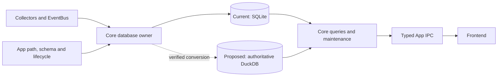

# Native DuckDB Hardware Archive Design

Status: recommended direction under
[ADR 0022](../adr/0022-prioritize-native-duckdb-archive-qualification.md).
Decision investigation: [#2052](https://github.com/shm11C3/HardwareVisualizer/issues/2052) (closed).
Implementation: [#2088](https://github.com/shm11C3/HardwareVisualizer/issues/2088),
[#2089](https://github.com/shm11C3/HardwareVisualizer/issues/2089), and
[#2090](https://github.com/shm11C3/HardwareVisualizer/issues/2090).

This document records why native DuckDB is the recommended archive direction,
how it fits the application, and which choices remain open. DuckDB would own
compression and query execution. The application still uses SQLite; an opt-in
candidate database builder starts the implementation.
[ADR 0019](../adr/0019-lossless-chunked-hardware-archive.md) continues to own
preservation, identity, retention, and recovery requirements.

## Problem and decision

Hardware Archive retains minute-level Process, system, GPU, ambient, and fan
observations. Cooling summaries and baselines and Storage Health records have
separate lifetimes and include mutable rows. With long Retention Periods, the
current row-oriented SQLite database becomes large and long-range Process and
Ambient queries become expensive.

The recommended direction is one native DuckDB file as the authoritative
application database after a verified conversion. Keeping raw archive data in
DuckDB while permanently leaving other tables in SQLite would divide related
snapshots, retention, recovery, and authority across engines without a shared
transaction. SQLite therefore remains the current implementation and the
migration source until the DuckDB design is implemented and verified; this is
not a permanent split topology.

## Why this direction

The experiments are synthetic and cover their declared Process and Ambient
fixtures. Rust/SQLx produced the SQLite chunk experiments. Python bindings
produced the engine comparison and initial DuckDB storage qualification.
Separate Rust release probes measured native build and idle-memory costs.
Timings are comparable within an experiment, not across harnesses.

| Alternative | Representative evidence | Decision use |
| --- | --- | --- |
| Existing SQLite rows | The one-year two-family fixture occupied 883.348 MiB; half-range Process p95 was 1,743.515 ms. | Remains the live source and behavior oracle during conversion. |
| SQLite custom chunks with raw reads | A 60-minute columnar/Deflate layout reduced the 24-hour fixture from 2.367 MiB to 0.301 MiB, but full Process decode and Ambient scan failed the 30-day and one-year comparisons. | Good compression did not solve long-range reads. |
| SQLite chunks with summaries and bounds | Unconditional Process summaries lost binary64 behavior: SQLite returned 1024.5 where merged summaries returned 1024.0. Under one-minute tuple churn, metadata expanded 9.727 MiB to 70.969 MiB and both Process ranges failed. Ambient bounds reduced one narrow decode from 955,580 to 2,727 rows, but wide ranges still missed two ceilings. | Useful pruning evidence, but the measured summary design is rejected. |
| Native DuckDB | The one-year fixture occupied 204.262 MiB; half-range Process p95 was 59.039 ms. It keeps database-local transactions but adds native build, binary, and memory cost. | Recommended prototype direction. |
| Parquet through DuckDB | The same fixture occupied 83.459 MiB; half-range Process p95 was 89.383 ms. Durable publication, manifest authority, replacement, and reader recovery were not implemented. | Strong capacity result, with more lifecycle ownership than a native database. |
| Permanent SQLite/DuckDB split | No end-to-end prototype measured it, and cross-engine operations lack a shared transaction. | Not selected without a new architectural reason. |

The detailed evidence is in the immutable
[initial layout benchmark](https://github.com/shm11C3/HardwareVisualizer/blob/713add956faaca2a8d43dec8cf5c47cd43d30ebf/docs/development/hardware-archive-g1-benchmark.md),
[query experiment](https://github.com/shm11C3/HardwareVisualizer/blob/75db64c972b39d94205800cafb6ccb15d6d6029a/docs/development/hardware-archive-g1-query-experiment.md),
[engine comparison](https://github.com/shm11C3/HardwareVisualizer/blob/75db64c972b39d94205800cafb6ccb15d6d6029a/docs/development/hardware-archive-g1-engine-comparison.md), and
[resource artifact](https://github.com/shm11C3/HardwareVisualizer/blob/58fad7ad54263079c1c2a74aa1b8396fcdcbd344/docs/development/benchmarks/hardware-archive-duckdb-resources-2026-09-06.json).
Their probe code records the algorithms and measurement settings:
[Rust resource probe](https://github.com/shm11C3/HardwareVisualizer/tree/fb8c7eefd1b2e68cbd84d5cf9145d3894718f5c6/core/examples/archive_engine_resource_probe),
[retention probe](https://github.com/shm11C3/HardwareVisualizer/blob/fb8c7eefd1b2e68cbd84d5cf9145d3894718f5c6/core/examples/archive_engine_benchmark/duckdb_retention_probe.py), and
[idle-memory probe](https://github.com/shm11C3/HardwareVisualizer/blob/43138be82a6f5ae3e35b27419ca347bd8a53d8f7/core/examples/archive_engine_benchmark/duckdb_idle_memory_probe.py).

## Ownership and runtime shape

Core continues to own persistence behavior, engine access, queries, migrations,
and maintenance. Because duckdb-rs is synchronous, the prototype should use a
dedicated blocking database owner with bounded requests and cancellation rather
than exposing connections through commands. App continues to own database path
resolution, ordered engine-specific schema definitions, startup and recovery
lifecycle, and typed IPC. The frontend continues to receive domain results and
incomplete-coverage information without storage routing.

The initial Rust candidate is
[`duckdb ~1.10505.0` with `bundled`](https://docs.rs/crate/duckdb/1.10505.0/source/README.md),
matching the measured DuckDB 1.5.5 engine. Bundling avoids a separately
installed runtime. File
[compatibility](https://duckdb.org/docs/current/internals/storage) remains a
separate versioning decision.

Long Process results still need bounded pages and cancellation; vectorized SQL
does not bound IPC output. Independent DuckDB instances need separate spill
directories. Exact connection lifetime, checkpoint scheduling, and failure
isolation belong to the implementation issues rather than this document.

## Resource trade-offs

The native probes ran on macOS arm64 with 24 GiB RAM. They are standalone
release executables sharing Tokio and the JSON protocol, not full Tauri builds.
The DuckDB executable adds **22.554 MiB** over the SQLx SQLite control, and its
single clean build took **273.97 s versus 44.30 s**.

| Executable | File MiB | Clean build s |
| --- | ---: | ---: |
| SQLx SQLite | 1.800 | 44.30 |
| Bundled DuckDB | 24.354 | 273.97 |

Build RSS, target allocation, compression comparisons, commands, and profile
details remain in the resource artifact. These results do not estimate
Windows/Linux builds, installers, or full application size.

Idle memory used three fresh processes per engine/fixture case. The table shows
the median current RSS of the three process medians for the 100,000 Process and
10,000 Ambient row fixture.

| Stage | SQLx SQLite MiB | Bundled DuckDB MiB |
| --- | ---: | ---: |
| Before database open | 6.312 | 7.922 |
| Open seeded database | 7.594 | 20.922 |
| Idle after queries | 14.578 | 28.578 |
| After connection/pool close | 14.516 | 28.562 |

These are standalone macOS current-RSS observations, not peak RSS or a
whole-application budget. Closing did not immediately return either process to
its before-open value. The evidence supports measuring a bounded database owner
inside the application; it does not select an idle timeout or establish a leak.
DuckDB's 128 MB engine memory setting is not a whole-process cap.

## Retention and physical allocation

Logical retention remains owned by Hardware Archive, Cooling, and Storage
Health. Cooling summaries and baselines can outlive raw rows, and user-selected
scheduled deletion remains distinct from physical compaction.

The bounded retention run started with 630,000 Process and 72,000 Ambient rows,
deleted 80%, then held 126,000 and 14,400 rows across eight append/expiry
cycles. All expected records passed full-field comparison. Physical allocation
shows two different maintenance choices:

| State | SQLite DB allocated MiB | DuckDB DB allocated MiB |
| --- | ---: | ---: |
| Before expiry | 73.824 | 29.012 |
| Immediately after expiry/checkpoint | 73.824 | 32.012 |
| After ordinary append/expiry reuse | 73.824 | 18.262 |
| Fresh compact copy | 14.203 | 6.762 |

DuckDB did not shrink in proportion to the initial deletion. Later writes
reused free space and checkpoints partially reduced the file. A fresh copy
reclaimed more space but required simultaneous source and destination storage
and rewrite work. The design therefore starts with normal expiry, reuse, and
checkpoint behavior. Copy compaction remains an optional maintenance trade-off
when recovered space justifies its temporary disk and lifecycle cost. The raw
artifact contains exact file/WAL/spill accounting and the read-only survivor
audit.

## Preserving meaning through conversion

One authoritative DuckDB file keeps raw archives, mutable summaries and
baselines, Storage Health, and schema metadata in one transaction domain. It
does not permit migration to reinterpret existing values. SQLite storage
class, signed i64, binary64 bits, text or blob bytes, nullness, IDs, and
multiplicity remain source facts until the candidate represents them honestly.

The
[initial native qualification](https://github.com/shm11C3/HardwareVisualizer/blob/1ef7751a0cc7e0ab84f58884103402c5023a9c6c/docs/development/hardware-archive-duckdb-initial-qualification.md)
showed exact round trips for tagged rows and typed rows with an exceptional-cell
sidecar. That was storage evidence, not exceptional-value query support, so the
exceptional-value query representation remains open in #2089.

The [candidate database builder](../../core/src/infrastructure/database/candidate_database/mod.rs)
chooses numeric types from the snapshot's actual storage classes. Normal CPU
and GPU writers store fractional readings in legacy INTEGER-affinity columns,
so refusing every REAL there rejects ordinary history. Integer-only columns
use BIGINT, real-only columns use DOUBLE, and mixed columns use native
`UNION(i BIGINT, r DOUBLE)`. Converting all values to DOUBLE would round large
integers and lose their original storage class. UNION retains both numeric
representations in the same column, but native queries must extract the
appropriate member; aggregate compatibility and the authoritative write schema
remain work for #2089. The candidate remains unselected, and unsupported
nonnumeric classes or invalid UTF-8 fail without replacing the source.

Original timestamp bytes remain stored. Source-compatible range membership
needs an explicit representation because SQLite and DuckDB differed at a
fractional boundary. Process identity remains the recorded `(pid,
process_name)` tuple, GPU IDs remain opaque archive values, and nulls and
missing intervals retain their domain meaning. ADR 0019 and the current query
owners hold the detailed contracts.

Conversion writes a separate DuckDB candidate while SQLite remains
authoritative. Mutable tables and recent appends need reconciliation from a
consistent source view. Authority changes only through durable selection after
reopen and verification;
an older SQLite copy cannot silently become current after DuckDB has accepted
new writes. The SQLite source remains available as a recovery copy until a
later verified startup and explicit cleanup.

A lifecycle probe completed 30 simulated minute-shaped transactions, retained a
pinned reader snapshot, reopened expected rows, and exercised committed and
in-flight termination cases. It supports the direction but does not replace
application-level concurrency, cancellation, migration, and power-loss tests.

### Finalization and the measured compatibility boundary

Finalization ([#2089](https://github.com/shm11C3/HardwareVisualizer/issues/2089))
adds one more step after the candidate: a separate copy into the App-owned
stable schema, refusing rather than coercing any cell the declared column cannot
hold. Two questions this document left open are now measured rather than
assumed.

**Timestamps.** The derived `__hv_timestamp_epoch_ms` key is not a Rust
reimplementation of SQLite's date-string grammar. Finalization runs the
production adapter (`archive_queries::sqlite_epoch_milliseconds_of`) against a
scratch in-memory SQLite database for each stored text, so the key is by
construction the value the current queries compute. The column stays nullable
even where its source `timestamp` is `NOT NULL`, because SQLite returns NULL for
text it cannot read as an instant and a missing conversion must stay missing
rather than become a guessed zero.

Native writers do not shortcut that adapter either, even though they hold the
`DateTime<Utc>` rather than the text. A Rust formula for "what the adapter would
return for this instant" was written, measured against the adapter over boundary
and randomized instants, and deleted: at
`1969-12-31T23:59:59.999500+00:00` the adapter answers 999 ms and the formula
answers 0 ms, because SQLite's `strftime('%s')` truncates that negative fraction
toward zero while its `%f` field still reports `59.999`, so the adapter's two
halves come from different seconds. A row stamped by the formula would sit in a
different bucket than the same row would occupy after conversion - the exact
divergence the derived column exists to remove. Each native write cycle
therefore takes its key from the same oracle, on the blocking lane it already
runs on.

**Aggregates.** SQLite's `avg()` over REAL has used Kahan-Babuska-Neumaier
compensated summation since 3.43, and DuckDB has no aggregate that reproduces
it: `avg`, `sum`, and the Kahan `fsum`/`favg` all lose the compensation.
Measured on 8,193-row Process fixtures across three row orders and 1/2/4 DuckDB
threads, DuckDB's `AVG` returns SQLite's exact binary64 bits for
archive-magnitude values - including denormal `f32` CPU readings and `i64`
memory extremes - and diverges only once one group's values span more than about
2^53, where `[x, 1.0, -x]` collapses to `0` against SQLite's `1/3`. `cpu_usage`
is an `f32` percentage, so the collector cannot produce that span. Whether the
residue justifies an exact Rust-side aggregation, at the cost of DuckDB's
vectorized grouping, is unresolved.

Integer averages do not use DuckDB's `AVG(BIGINT)` at all. It divides the exact
sum as a `long double`, whose width is 80 bits on x86_64 Linux and 64 bits on
aarch64 macOS and MSVC, so the same rows produced results one ulp apart across
CI platforms. The native query reads the exact `SUM` and `COUNT` and performs
SQLite's own arithmetic - two binary64 conversions and one division - in Rust,
which is bit-identical everywhere. A sum beyond `i64` becomes a query error
rather than a different number; SQLite abandons exact summation there too, and
an `i32` `memory_usage` writer cannot reach it within a Retention Period.

**Write-time timestamps and the cooling projections.** A native *writer* faces
the mirror of the finalizer's problem: it has the `DateTime<Utc>`, but it must
store the bytes sqlx would have stored (every timestamp comparison in these
families is a byte-wise text comparison) *and* the key finalization would have
derived from those bytes. Those two are not the same arithmetic.
`timestamp_millis()` truncates; SQLite's date parser rounds a fractional second
to the nearest millisecond, so a `.000500` microsecond stamp diverges from a
`.000499` one only under SQLite's rule - measured at 1,788,221,700,001 against
1,788,221,700,000, where `timestamp_millis()` gives both rows 1,788,221,700,000.
Rather than re-deriving the rounding rule in Rust, where the tie lands on
whichever side binary64 rounds `s*1000` to, the writer runs the same in-memory
SQLite oracle the finalizer runs, once per write cycle on a blocking task. The
key it produces is therefore the value finalization would have computed for the
row, by construction rather than by agreement. A NULL back from the oracle is
refused rather than stored: the text being converted is the writer's own
rendering of a `DateTime<Utc>`, so a NULL would mean the two engines disagreed
about our own output - a defect, not a missing reading.

Three systematic differences, and nothing else, separate the native cooling and
ambient/fan queries from their SQLite counterparts. Epoch keys are read from the
stored `__hv_timestamp_epoch_ms` column instead of recomputed per row, which
also removes the widened raw-TEXT brackets SQLite carries purely so its
timestamp index can be range-scanned - a native stored key needs no such hint,
and the brackets were chosen to be incapable of excluding a row the exact
predicate keeps. Integer division is spelled `//`, because SQLite's `/` between
integers truncates toward zero while DuckDB's `/` returns a DOUBLE; the two
agree on every present-day epoch, so the choice is pinned against SQLite over
pre-epoch values rather than left to a fixture that could not see it.
`CAST(cpu_avg AS REAL)` goes through `union_extract` against the tagged
`UNION(i BIGINT, r DOUBLE)` columns. The one place the native query reproduces a
SQLite *approximation* on purpose is the pairable-ambient cursor's two-minute
text bracket: it is the only clause whose answer depends on raw text comparison
across writers, so it is transcribed rather than dropped, keeping the two
engines identical even on a database hand-edited into mixed timestamp spellings.

A fourth difference had to be removed rather than described. SQLite has no NaN:
`sqlite3VdbeMemSetDouble` stores a bound IEEE NaN as NULL, so every SQLite
writer here silently turns a NaN reading into a gap, and into a `NOT NULL`
column it fails the insert outright. Both behaviours are measured against sqlx
rather than taken from the documentation. A native writer binding the NaN
straight through would change nullness - `AVG` would propagate it, `COUNT` would
count it, and a lane would draw NaN where the same rows written through SQLite
draw a break - so every real-valued bind goes through one shared helper that
returns the absence SQLite would have stored, and a NaN bound for a `NOT NULL`
column is refused with a typed error naming the column. `±Infinity` is a value
in both engines and is deliberately left alone. The open question about DuckDB's
`AVG` above is not confined to Process Stats: the ambient, fan and cooling
averages read through the same `AVG(DOUBLE)`, so they carry the same binary64
residue once one bucket's finite `f32` readings span more than about 2^53,
which no collector this application ships can produce.

One rolled-up day's six projections - daily, hourly, fan, Thermal Delta, and
both co-variate shapes - are written in a single native transaction, as they are
in SQLite. A committed daily row with its later projections missing is the
half-written state the catch-up cursor would have to repair, and it cannot tell
that case apart from a day that legitimately had none once the archive rows
behind it age out; failing the day as a whole leaves the cursor unmoved so the
next pass retries it.

### The archive families, and where they deliberately differ

The DATA_ARCHIVE and GPU_DATA_ARCHIVE families
([#2089](https://github.com/shm11C3/HardwareVisualizer/issues/2089)) are
compared against their SQLite counterparts by putting one fixture through both
paths and comparing bit for bit - the bucket grid at both stamp ends, the gap
convention, the refusals, the stored cell classes, and the rows a Retention
Period leaves behind. Three results are worth recording as decisions rather than
as test detail.

**Storage class is part of the row.** `cpu_*`, `ram_*`, `usage_*` and
`temperature_avg` are declared INTEGER in SQLite but written from `Option<f32>`,
so SQLite's INTEGER affinity stores an integral reading as an integer and a
fractional one as a real - which is why a finalized archive holds these as
`UNION(i BIGINT, r DOUBLE)` at all. A native writer that always wrote the real
member would produce rows that read back as the same numbers while being a
different row; the writers apply the affinity rule instead. The same measurement
turned up SQLite's negative-zero behaviour: `-0.0` becomes the integer `0` in an
INTEGER column and loses its sign in a REAL one, so the writers reproduce that
too.

**Mixed classes are reduced by the cast, not compared exactly.** Both series
queries cast every cell to binary64 before aggregating, so an integer past 2^53
is rounded identically by both engines. The averaging boundary from the previous
section applies to this family as well - `cpu_avg` is INTEGER-declared, so a
legacy row can carry a value large enough for the compensated-summation
difference to appear, measured at two ulps - but no current writer can produce
one, since every reading arrives as `f32`.

**An unreadable stamp is a gap in both engines.** A stored timestamp SQLite
cannot read as an instant - a spelling no current writer produces, but one a
released build could have left behind - has no epoch key, so a bucketed series
omits it: SQLite groups it under a NULL bucket that decodes to `0` and falls
outside every askable range, and the native query reads the same NULL the same
way. Refusing the whole range instead was considered and rejected: the rest of
the row is not wrong, every query that is not bucketed by time still returns it,
and failing a range over one legacy row would cost more than it tells anyone.
Conversion is the one moment the whole archive is read, so that is where such
rows are counted - `NativeTableReport::unconvertible_timestamps`, per table,
informational and never a refusal.

### Reconciliation and durable authority selection

Finalization copies one pinned snapshot, and the application keeps writing to
SQLite while that copy runs, so the finalized file is stale the moment it
exists. Reconciliation ([#2090](https://github.com/shm11C3/HardwareVisualizer/issues/2090))
closes the gap by capturing a *second* candidate from the live source and making
the finalized file equal to it. Reusing the candidate builder rather than
reading SQLite a second way keeps the pinned transaction, the canonical-cell
validation and the per-row size bounds in one place; the cost is one more file
on disk while it runs, which the space preflight budgets.

**Every table is diffed by primary key, not by an id high-water mark.** An
append-only fast path is not available in this schema: Retention Period pruning
deletes from `DATA_ARCHIVE`, `PROCESS_STATS`, `AMBIENT_ARCHIVE` and
`FAN_ARCHIVE`, and the cooling and Storage Health summaries are recomputed in
place. A high-water path would need a second, hand-maintained declaration of
which tables may lose rows, and it would save nothing, because the mandated
reopen verification reads every row back either way. All fifteen tables, the
re-imported identity high-water marks and the metadata row are written in one
transaction, so an interruption - including a cell the stable column cannot
hold, discovered on the last table - leaves the previous database untouched.

**What guards against a migration that ran in between.** The candidate's
`source_schema_sha256` looks like a schema digest but is recomputed after the
rows are scanned, so it also covers the storage classes each column was
*observed* to hold: a writer binding its first `Option<f32>` into an
INTEGER-declared column changes it without any migration. Comparing it would
strand the conversion on exactly the data shape the tagged-union columns exist
to carry. The structural comparison against the App-owned stable schema is the
gate instead - the table sets and the column names in both directions, for every
table, before the transaction opens - so a migration is refused with the table
and column named and nothing written. Both digests are reported.

**Only a reconciled file can be selected, and the caller must quiesce first.**
A finalized file copies one snapshot taken while the application kept writing,
so it is stale by construction; selecting it would drop whatever SQLite
recorded in between. The proof selection accepts is minted only by a successful
reconciliation and has no public constructor, and the file itself records
whether a reconciliation committed into it, so a look-alike file - one
re-finalized from the same unchanged source - is refused by the database as
well as by the type. What neither can see is a writer that kept running: a
reconciliation makes the file equal the source *at the moment it captured its
candidate*. Quiescing every SQLite writer before the final reconciliation, and
keeping them quiesced until selection returns, is the App lifecycle owner's
obligation and is documented on the proof type.

**Selection is recorded twice, database first.** A backend selection cannot be
undone by deleting a file, so it is written into the native database's own
metadata (committed, checkpointed, synced) and then into a small marker file
beside it. That order leaves exactly one interruption window - the database says
`selected`, the marker is missing - and that state is repairable without
guessing, by rewriting the marker from the database. The reverse order would
leave a marker claiming a selection the database never recorded, which nothing
can resolve. Every other disagreement between the two is reported with its
numbers rather than repaired; recovery code that guesses which of two files is
authoritative is how history gets lost silently. The state vocabulary stays at
two values, `finalized_unselected` and `selected`, so the recovery decision
stays small enough to enumerate.

**Space is budgeted before anything is copied, in bytes.** The requirement is
`candidate + finalized + workspace`, each database term starting at the full
size of the source plus its `-wal`/`-shm` sidecars. All three coexist, because
reconciliation holds a second candidate while the finalized file is on disk and
stages its changed rows in the workspace. No compression is assumed; a measured
ratio from an earlier conversion may only raise the estimate. A short volume is
refused with the two numbers rather than discovered halfway through. Free space
is attributed by matching the workspace against the longest mount point that
prefixes it, with Windows extended-length (`\\?\`) paths rewritten to the
ordinary spelling the mount table uses - `Path::canonicalize` returns the
verbatim form there and `Path::starts_with` compares the prefix component, so
without the rewrite a supported platform would report its free space as
unknowable.

## Remaining design questions

- [#2089](https://github.com/shm11C3/HardwareVisualizer/issues/2089): native
  queries and write schema, numeric/exceptional-value compatibility, timestamp
  adapters, database owner lifetime, cancellation and retention.
- [#2090](https://github.com/shm11C3/HardwareVisualizer/issues/2090):
  supported-platform packaging and application resource evidence. Reconciliation
  and durable selection are settled above. Retiring the SQLite source after a
  later verified startup is decided as a **rename in place** (2026-09-13): it
  is atomic and needs no extra disk, which is what the space preflight already
  budgets. A copy would only protect a downgraded older build from starting on
  an empty database, and downgrade behavior is deferred by
  [#2052](https://github.com/shm11C3/HardwareVisualizer/issues/2052); the
  current build's authority marker already refuses to create an empty database
  when the native file is missing. The App lifecycle owner implements the
  rename.
- [#2084](https://github.com/shm11C3/HardwareVisualizer/issues/2084) and
  [#2085](https://github.com/shm11C3/HardwareVisualizer/issues/2085) retain the
  investigation evidence for unresolved lifecycle and delivery choices.
